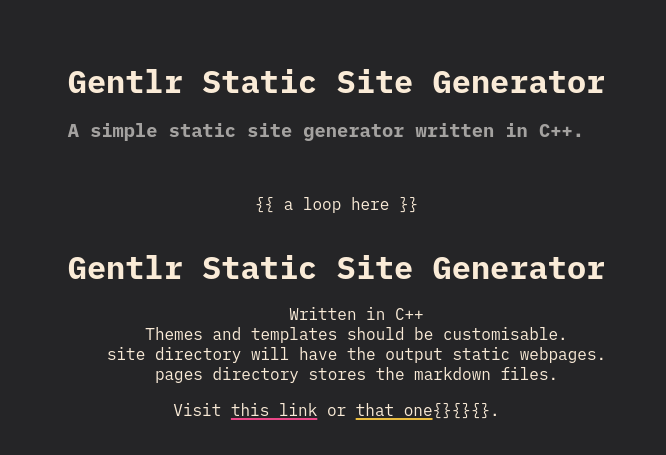

# GentlrSSG
#### A static website generator written in C++.
**Work In Progress**

## Build Status

## Features
- [x] Markdown support
- [x] Customizable themes
- [ ] Template engine
- [ ] Asset management
- [ ] Toml configuration
- [x] Metadata extraction
- [ ] Pagination
- [ ] Customizable metadata

